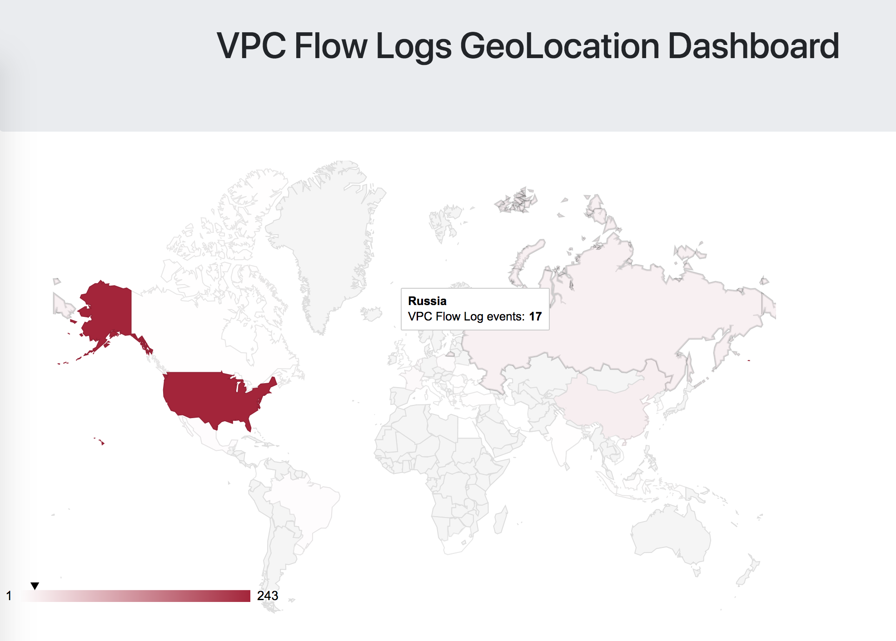

# IpGeoLocatorDashboard
Small PoC to analyze AWS VPC Flow Logs in near real-time by enriching IP address info with geolocation metadata

### Scenario

I've been using VPC Flow Logs for analytics for a while, and I've even written some analytics tools using AWS Athena & Glue to issue queries via SQL to aggregate throughput metrics. Occasionally I'll look at the logs and notice the various access attempts to my resources, and how those attempts span the globe. 

I thought an interesting experiment would be to visualize *where* various access attempts to my AWS VPC resources are coming from, and to do so in a near realtime fashion in the browser.

### Architecture

TODO: architecture visualization 

VPC Flow Logs are the core of this architecture. You pick a Flow Log when deploying the CloudFormation stack, and that log gets streamed via a CloudWatch Logs subscription to a Lambda function. The Lambda function JSONifies the payload, and then enriches that payload with geolocation data; the function then publishes that payload to an MQTT topic in AWS IoT. 

Why AWS IoT? Because we can access that message stream in a browser using MQTT over WebSockets! For access, I use a Cognito Identity Pool (in unauthenticated access mode), which will vend temporary AWS credentials for accessing the AWS IoT service endpoint. 

### Visualization

Visualization is a pretty basic affair - we're doing everything in the browser via the AWS JavaScript SDK, a Paho MQTT client, Google Geocharts, and a few additional support scripts. At time of writing this (June 8, 2018), the dashboard simply visualizes the incoming stream of events on a world map. It looks like so: 

### Deployment

As you might imagine, you'll need to have VPC Flow Logs enabled on one of your VPCs in AWS. Take note of the *name* of that log in CloudWatch Logs, as you'll use that as an input when you deploy the CloudFormation stack.

Use the CloudFormation template in the `cfn` directory, and use the outputs from the stack to modify the correct details in `dashboard/js/variables.js` (make sure to check `variables-example.js`!!!), and you should be good to go. 
